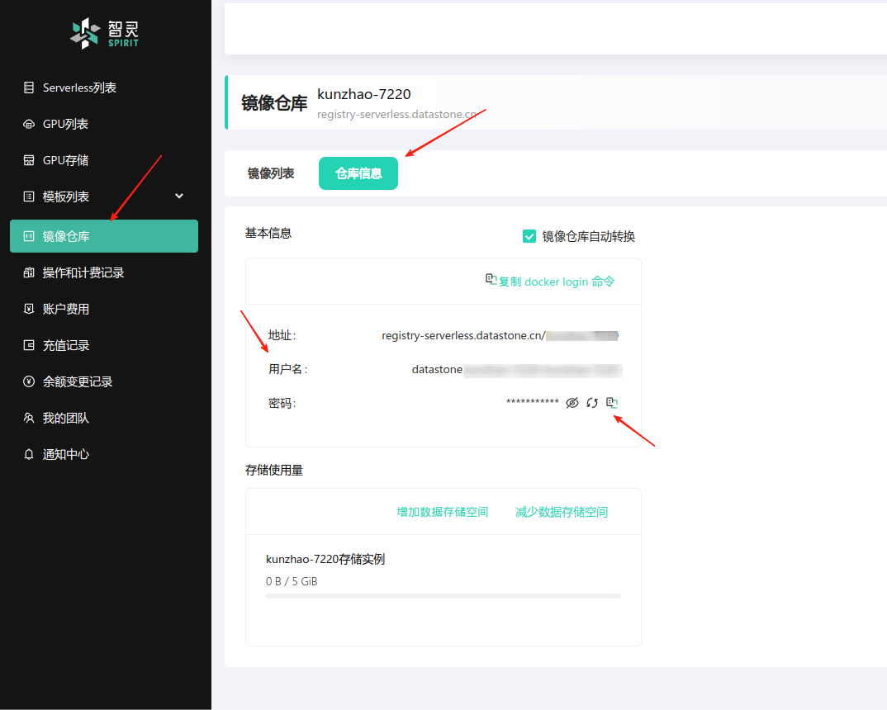
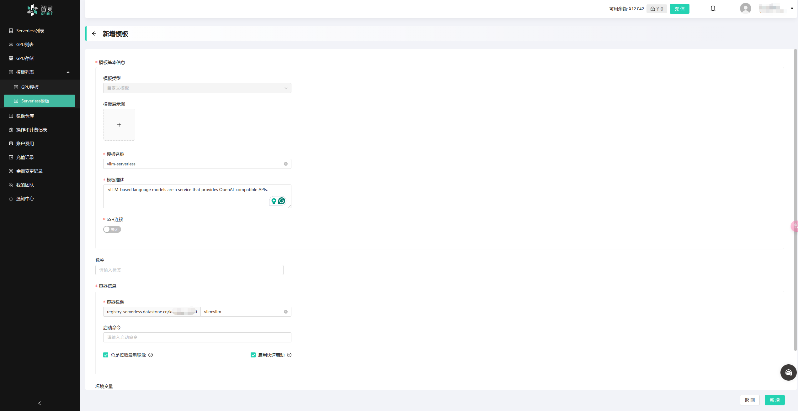
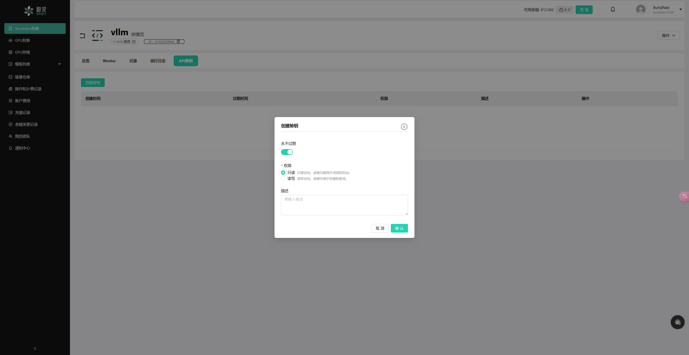
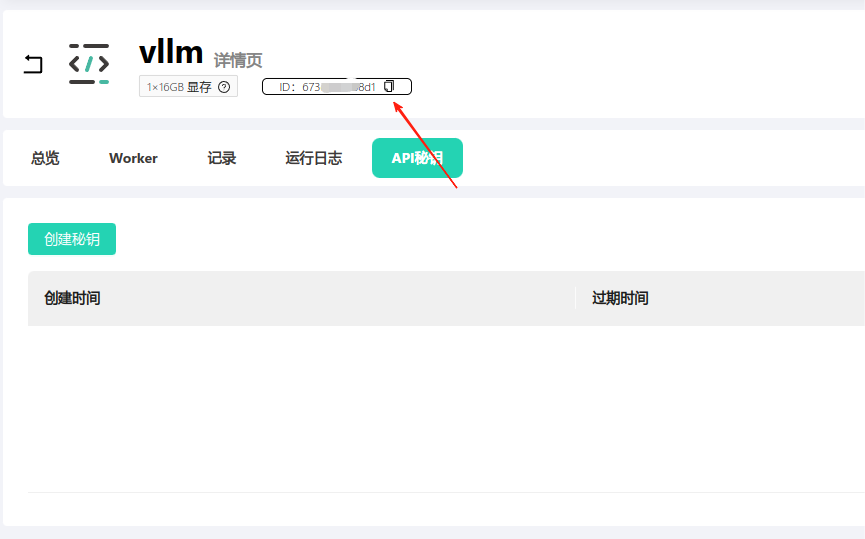

# vLLM serverless template for Spirit

[中文版](./README_zh.md)

## Introduction

This is a simple example of how to deploy a serverless in the Spirit serverless platform with the fewest code possible. In the demo we deploy a serverless service, the serverless has the compitable API interface of the OpenAI GPT-3 API.

## Prerequisites

- Create a Spirit account: You must have a Spirit account to deploy the serverless service. If you don't have an account, you can create one [here](https://serverless.datastone.cn/).

- Install Docker and Docker Compose: You need to have Docker and Docker Compose installed on your local machine. You can download Docker Desktop from [here](https://www.docker.com/products/docker-desktop).


## How to deploy

If you want to deploy the serverless service on the Spirit platform, The following steps are required:

- Build a docker image for the serverless service (Explain the Dockerfile)
- Push the docker image to the Spirit platform
- Create a template for the serverless service
- Create a serverless service with the template, and setting relevant parameters

### Build the docker image

First of all, you need to build the docker image for the serverless service. The Dockerfile in the root directory of the project is used to build the docker image. You can build the docker image by running the following command:

```bash
registry=registry-serverless.datastone.cn tenant='{your_tenant_name}' docker compose build vllm
```

> Note: You should use the correct tenant name to subtitude the `{your_tenant_name}` in the above command.

Runing the above command will build the docker image for the serverless service. The docker image will be tagged with the name `registry-serverless.datastone.cn/{your_tenant_name}/vllm:vllm`.

### Explained the Dockerfile

Let me explain this Dockerfile which sets up a multi-stage build for a vLLM (vector language model) service:

#### First Stage: Model Builder

The first stage uses `nicolaka/netshoot` as a base image and is named `model-builder`. This stage:

1. Installs Git LFS (Large File Storage) by:
   - Downloading the Git LFS package
   - Extracting and installing it
   - Cleaning up the downloaded archive

2. Installs the Hugging Face CLI tool using pip with the `--break-system-packages` flag

3. Downloads a specific model (`phi-4-bnb-4bit`) from Hugging Face into a local directory

#### Second Stage: Final Image

The second stage uses a CUDA-enabled Ubuntu 22.04 image with Python 3.11 and PyTorch 2.5.1, named `vllm`. This stage:

1. Sets up the working directory for the model
2. Copies the downloaded model from the first stage
3. Installs Python dependencies from requirements.txt
4. Copies source code and startup script
5. Makes the startup script executable
6. Sets the default command to run the startup script

#### Key Features

- Uses multi-stage building to keep the final image size smaller
- Integrates CUDA support for GPU acceleration
- Implements a proper model download and setup process
- Follows best practices by cleaning up unnecessary files after installation
- Uses `ARG BASE_URL` to allow flexible base image sourcing

This Dockerfile is designed to create a containerized environment for running a  serverless that proxying the request to background running vLLM service with the phi-4 model in a production environment.

### Push the docker image

Before you push the docker image to the Spirit image registry, you need to login to the Spirit platform by running the following command:

```bash
docker login registry-serverless.datastone.cn
Username: 
Password:
```

You should use the correct username and password to login to the Spirit image registry. The login username and password you can obtain from the Spirit platform like below diagram:



> Note: The default registry capacity is 5GB, if you need more capacity, click the `增加数据存储空间` button to increase the capacity. Ensure you have 2x the image size available in registry space due to fast-boot conversion.

After you login to the Spirit image registry, and ensure you have enough registry capacity, you can push the docker image to the registry by running the following command:

```bash
docker push registry-serverless.datastone.cn/{your_tenant_name}/vllm:vllm
```

### Create a template for the serverless service

After you push the docker image to the Spirit image registry, you need to create a template for the serverless service. The template is used to define the serverless service, including the docker image, environment variables, and other configurations. 

Open the Spirit platform, nviagete to the `模板列表` / `Serverless 模板` page, and click the `新建模板` button to create a new template. You can fill in the template information like below diagram:



- Given a unique name for the template and human readable description.
- Ensure image name is `vllm:vllm` other parts of the image tag was automatically filled in by the Spirit platform.
- `总是拉取最新镜像` is used to set the serverless service always pull the latest docker image when it starts, it's very useful when you debug the serverless.
- `启用快速启动` is used to enable the fast-boot feature for the serverless service, it will reduce the cold start time of the serverless service. Make sure the option is enabled.
- The `环境变量` is used to set the environment variables for the serverless service. 

- Click the `保存` button to save the template.

### Create a serverless service

After you create the template for the serverless service, you can create a serverless service with the template. Open the Spirit platform, navigate to the `Serverless 列表` page, and click the `新建Serverless` button to create a new serverless service. You can set option in the page :


- Given a unique name for the serverless service.
- Select GPU specification for the serverless service, eg: you can choose `4090-4xmedium-8-1` which means the serverless service will use 1x NVIDIA RTX-4090 GPU with 4xCPU and 32GB memory.
- Setting the active worker and maxium worker for the serverless service. The active worker is the number of worker that will be started when the serverless service starts, the maxium worker is the maximum number of worker that the serverless service can start. The active worker will always run to handle the request, no matter there are incoming requests or not. The maxium worker is used to limit the number of worker that the serverless service can start, it's useful to prevent the serverless service from starting too many worker and consuming too much resource.
- Setting the worker scaling up policy for the serverless service, there are two type of policy, one is measured by request queuing count and the other is measured by time that request wait for. You can choose the policy based on your requirement. When the concurrent request fulfill the policy, the serverless service will start a new worker to handle the request.
- Idle duration is used to set the duration that the worker will be kept alive after the worker is idle. The worker will be terminated if the worker is idle for the duration.
- Select the template that you created before from the template dropdown list.
- Click the `保存` button to save the serverless service.

After you save the serverless service, the serverless service will be created and started. You can click the serverless service name to view the serverless service detail page. You can view the serverless service status, logs, and other information in the detail page.

## How to use

### Create the serverless secret

Click the serverless name you created before. In the serverless detail page, there is a `API密钥` tab, click the `Secret` tab to switch to it and create a secret by clicking the `新建密钥` button like below diagram:



After click 'OK' button, the secret will be created and you must save the secret value to a safe place, because the secret value will not be displayed again.

### Invoke the serverless service

You can test the serverless service by the curl command like below:

```bash
curl https://api-serverless.datastone.cn/v1/chat/completions \
    -H "Content-Type: application/json" -H "Authorization: {severless-id}-{serverless-key}" \
    -d '{
        "model": "/workspace/vllm/phi-4-bnb-4bit",
        "messages": [
            {"role": "system", "content": "You are a helpful assistant."},
            {"role": "user", "content": "Write a python game program"}
        ]
    }' 
```

> {serverless-id} and {serverless-key} should be replaced with the serverless id and secret value you created before.
> you can check the serverless id in the serverless detail page like below diagram:


The above command will send a request to the serverless service to generate the completion for the given messages. The serverless service will return the completion for the given messages.